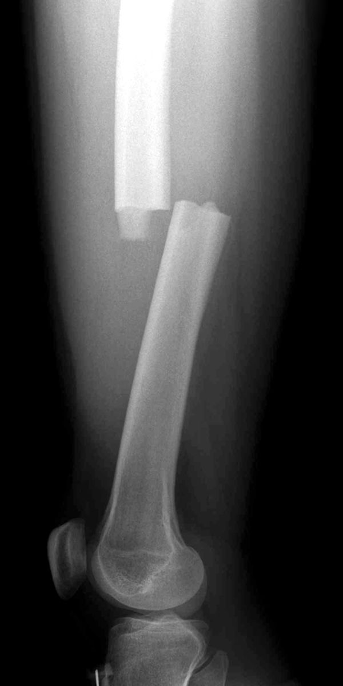

# Image Enhancement using OpenCV

Proyecto del Grupo 2 para mejorar imágenes utilizando OpenCV, SciPy y una interfaz web en Streamlit.
Incluye un pipeline modular reutilizable, CLI configurable y una app web para previsualizar resultados.

## Tabla de contenidos
- [Resumen](#resumen)
- [Requisitos](#requisitos)
- [Instalación](#instalación)
- [Uso](#uso)
  - [CLI](#cli)
  - [Interfaz web Streamlit](#interfaz-web-streamlit)
- [Resultados de ejemplo](#resultados-de-ejemplo)
- [Créditos](#créditos)
- [Licencia](#licencia)

## Resumen
- Pipeline que trabaja en espacio LAB para preservar color mientras realza luminancia.
- Filtros medianos y bilaterales configurables para reducción de ruido sin sacrificar bordes.
- CLAHE y corrección gamma ajustables para controlar contraste y brillo.
- Máscara de realce (unsharp) opcional para recuperar nitidez.
- CLI con argumentos para procesar carpetas completas o imágenes individuales.
- Interfaz web (Streamlit) con sliders interactivos, comparación lado a lado y descarga directa.
- Página adicional en la app web que lista dinámicamente los aportes y mejoras del proyecto.
- Botón demo que activa Restormer (transformer) con controles de nitidez y mezcla para comparar un modelo avanzado con el pipeline clásico.

## Requisitos
- Python 3.8 o superior.
- Windows, macOS o Linux con soporte para OpenCV.
- (Opcional) PyTorch 1.12+ para habilitar el modo Restormer en la interfaz web.

## Instalación

> Recomendado: trabajar dentro de un entorno virtual (venv) para aislar dependencias.

1. Clona el repositorio y entra a la carpeta del proyecto:
   ```bash
   git clone <url-del-repo>
   cd AIML-Image-Enhancement
   ```

2. Crea y activa un entorno virtual:
   - **Windows (PowerShell):**
     ```bash
     python -m venv .venv
     .\.venv\Scripts\Activate
     venv\Scripts\activate
     ```
   - **macOS / Linux (bash/zsh):**
     ```bash
     python3 -m venv .venv
     source .venv/bin/activate
     ```

3. Instala las dependencias básicas (CLI) o completas (CLI + Streamlit):

   ```bash
   pip install --upgrade pip
   pip install opencv-python scipy numpy
   # Para la app web añade:
   pip install streamlit
   # Para el modo Restormer (CPU) añade PyTorch:
   pip install torch torchvision --index-url https://download.pytorch.org/whl/cpu
   pip install scipy
   ```

   > Sugerencia: crea un `requirements.txt` con estas dependencias para instalar todo con `pip install -r requirements.txt`.

4. (Opcional) Si usarás imágenes grandes, instala OpenCV contrib y habilita paquetes de optimización:
   ```bash
   pip install opencv-contrib-python
   ```

## Uso

### CLI

Procesa una carpeta completa (por defecto `Dataset`) y guarda resultados en `Results`:
```bash
python image_enhancement.py --input Dataset --output Results
```

Argumentos útiles:
- `--gamma 1.2` ajusta el brillo global (default `1.4`).
- `--no-color` fuerza salida en escala de grises.
- `--no-sharpen` desactiva la máscara de realce.
- `--log-level DEBUG` aumenta la verbosidad.

También puedes procesar un archivo específico:
```bash
python image_enhancement.py --input Dataset/imagen.jpg --output Results
```

### Interfaz web Streamlit

Lanza la aplicación web con dos páginas (laboratorio y aportes):
```bash
streamlit run streamlit_app.py
```

En el navegador podrás:
- Subir una imagen y ajustar parámetros mediante sliders.
- Comparar original vs. mejorada lado a lado.
- Descargar la imagen resultante en PNG.
- Ver un resumen dinámico de las contribuciones del equipo.
- Activar el botón "Restormer (demo)" para ejecutar un modelo transformer preentrenado, ajustar un realce extra y mezclar su salida con el pipeline clásico (descarga ~100 MB la primera vez).

## Resultados de ejemplo

| Original | Procesada |
|---|---|
|  |  |
|  |  |

(Actualiza estas imágenes con tus propios resultados si lo deseas.)  

## Créditos
- Basado en técnicas clásicas de OpenCV y SciPy.
- Mejoras y documentación por el Grupo 2: Alejandro Martinez, Giovana Marachi, Yamili Acosta y Pedro Florenciano.

## Licencia
Distribuido bajo la licencia [MIT](LICENSE). Presenta los créditos originales y respeta los términos indicados.
